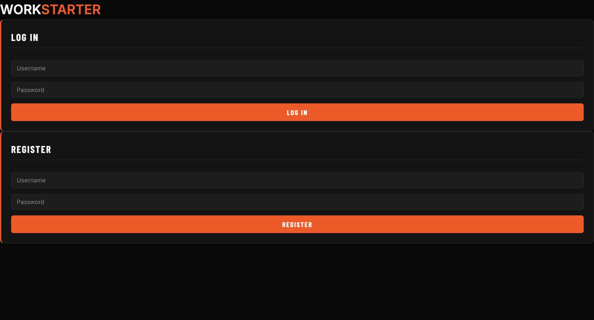
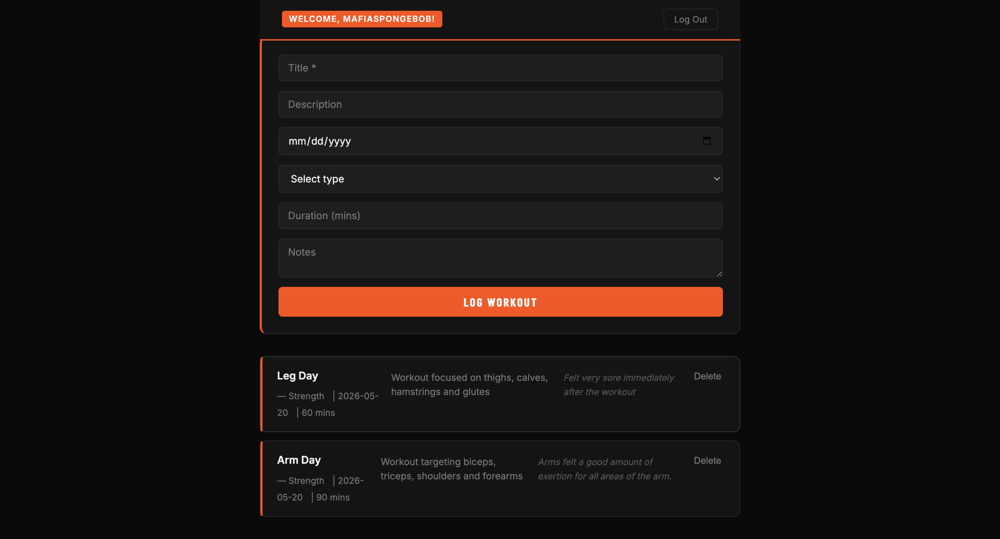

# Workstarter — Workout Tracker

A full-stack workout tracker built with React, Express, and Postgres. Built for workout enthusiasts who want to log, organize, and track their personal fitness progress. Each user owns their own workout history.

## User Stories

**Auth**

- A user can register for an account with a username and password
- A user can log in to an existing account
- A user can log out
- A returning user who has an active session is automatically logged in when they revisit the app

**Workouts**

- A logged-in user can see all of their workouts
- A logged-in user can log a new workout with a title, description, date, type, duration, and notes
- A logged-in user can delete a workout they no longer want

## Schema

```
users
─────────────────────────────
user_id       SERIAL PRIMARY KEY
username      TEXT UNIQUE NOT NULL
password_hash TEXT NOT NULL

workouts
─────────────────────────────
workout_id  SERIAL PRIMARY KEY
title       TEXT NOT NULL
description TEXT
date        TEXT
type        TEXT
duration    INT
notes       TEXT
user_id     INT REFERENCES users(user_id) ON DELETE CASCADE
```

A user has many workouts. Deleting a user cascades to delete all of their workouts.

## API Contract

### Auth endpoints

| Method | Endpoint             | Request Body             | Response                          |
| ------ | -------------------- | ------------------------ | --------------------------------- |
| POST   | `/api/auth/register` | `{ username, password }` | `{ user_id, username }`           |
| POST   | `/api/auth/login`    | `{ username, password }` | `{ user_id, username }`           |
| DELETE | `/api/auth/logout`   | —                        | `{ message }`                     |
| GET    | `/api/auth/me`       | —                        | `{ user_id, username }` or `null` |

### Workout endpoints (all require authentication)

| Method | Endpoint                    | Request Body                                                | Response                                                                     |
| ------ | --------------------------- | ----------------------------------------------------------- | ---------------------------------------------------------------------------- |
| GET    | `/api/workouts`             | —                                                           | `[{ workout_id, title, description, date, type, duration, notes, user_id }]` |
| POST   | `/api/workouts`             | `{ title, description, date, type, duration, notes }`       | `{ workout_id, title, description, date, type, duration, notes, user_id }`   |
| PATCH  | `/api/workouts/:workout_id` | `{ title?, description?, date?, type?, duration?, notes? }` | `{ workout_id, title, description, date, type, duration, notes, user_id }`   |
| DELETE | `/api/workouts/:workout_id` | —                                                           | `{ workout_id, title, description, date, type, duration, notes, user_id }`   |

## Setup

### 1. Database

Create a local Postgres database:

```sh
createdb workouts_db
```

### 2. Server

```sh
cd server
npm install
cp .env.template .env
```

Open `.env` and fill in your Postgres credentials and a session secret. Then seed the database:

```sh
npm run db:seed
```

Start the server:

```sh
npm run dev
```

The server runs on `http://localhost:8080`.

### 3. Frontend

In a second terminal:

```sh
cd frontend
npm install
npm run dev
```

The frontend runs on `http://localhost:5173`. The Vite dev proxy forwards all `/api` requests to the Express server so session cookies work correctly.

## Seed Users

After running `npm run db:seed`, these accounts are available:

| Username | Password    |
| -------- | ----------- |
| denji    | password123 |
| reze     | password123 |

## Application Structure

```
workstarter/
├── frontend/               # React app (Vite)
│   ├── src/
│   │   ├── App.jsx         # Root component: currentUser state, session rehydration, auth handlers
│   │   ├── adapters/
│   │   │   ├── auth-adapters.js     # Fetch adapters for /api/auth/* endpoints
│   │   │   └── workout-adapters.js  # Fetch adapters for /api/workouts/* endpoints
│   │   └── components/
│   │       ├── AuthPage.jsx       # Login + Register forms (shown when logged out)
│   │       ├── WorkoutPage.jsx    # Main app container (shown when logged in)
│   │       ├── AddWorkoutForm.jsx # Form to create a new workout
│   │       ├── WorkoutList.jsx    # Renders a list of WorkoutItems
│   │       └── WorkoutItem.jsx    # Single workout: title, type, date, duration, notes, delete button
│   └── vite.config.js      # Proxies /api requests to Express in development
└── server/                 # Express + Postgres API
    ├── index.js            # App entry point, route definitions
    ├── controllers/
    │   ├── authControllers.js     # register, login, logout, getMe
    │   └── workoutControllers.js  # list, create, update, delete workouts
    ├── models/
    │   ├── userModel.js    # SQL queries for the users table
    │   └── workoutModel.js # SQL queries for the workouts table
    ├── middleware/
    │   ├── checkAuthentication.js  # Blocks unauthenticated requests
    │   └── logRoutes.js            # Logs each incoming request
    └── db/
        ├── pool.js         # Postgres connection pool
        └── seed.js         # Creates tables and inserts sample data
```

## Roadmap

Stretch features planned for future development:

- Edit/update a workout (PATCH form on the frontend)
- Workout summary stats (total duration, workouts per week)
- React Router for a dedicated workout detail page
- Filter workouts by type or date range

## Screenshots

### Login



### Workout Tracker



## Project Board

[Workstarter Scrum Board](https://github.com/users/felixvargas7/projects/3)
